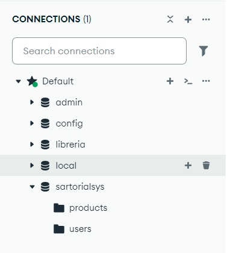

# SartorialsysWeb
Sistema Web para una Sastrería

## Configuración del Entorno
### Estructura del Proyecto
El proyecto se encuentra dividido y estructurado con la arquitectura MEAN:
- Base de Datos con MongoDB Community Server v8.0.1
- Backend con Express v4.21.2
- Frontend con Angular v16.2.10
- Servidor con Node v22.12.0

    ***NOTA: Instalar lo necesario***

La division del Proyecto se encuentra
- backend-api
- frontend

### Base de Datos
Para la ejecución correcta del proyecto se debe tener instalado MongoDB Community Server: `https://www.mongodb.com/try/download/community`

Una vez instalado se puede usar MongoDB Compas para crear la base de datos con ayuda de la conexión por defecto (default)

Crear la base llamada sartorialsys y 2 colecciones (users y products)

   

### Dependecias
#### Angular
Para asegurase de que se tiene Angular se debe colocar en la terminal

#### Backend-API
Para el backend funcione correctamente abrir la terminal/consola en el directorio raiz y cambiarse a la carpeta *"banckend-api"*

```
cd backend-api
```

estando ya en la carpeta se puede ejecutar los siguientes comandos
```
npm install
npm run dev
```

con esto el API se levantara correctamente y en la terminal debe salir el mensaje
```
Server running at port -> 3000
Documentation available at -> localhost:3000/api-docs/
Database Connect
```

Con esto la API esta levantada

#### Frontend
Para el frontend se debe abrir una terminal adicional y dirigirse a la carpeta *"frontend"*
```
cd frontend
```
Estando en la carpeta, se puede ejecutar los comandos
```
nmp install
ng serve
```
Con esto se levanta el Frontend y se puede visitar el `localhost:4200/` y visualizar la web

## Documentación adicional

Para más detalles, revisar:
- Backend-API: [README.md Backend-API](./backend-api/README.md).
- Frontend: [README.md Angular](./frontend/README.md).